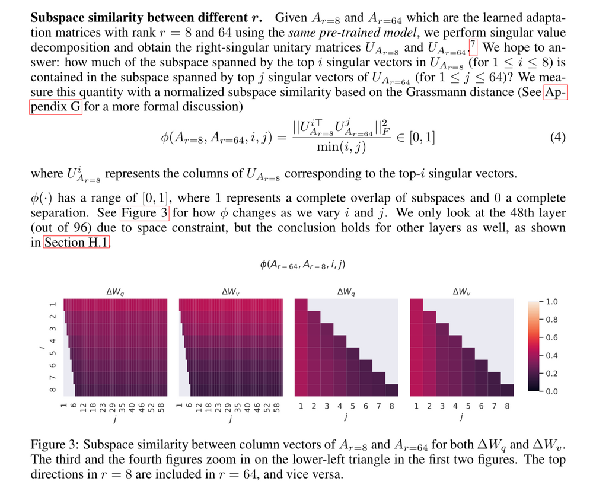
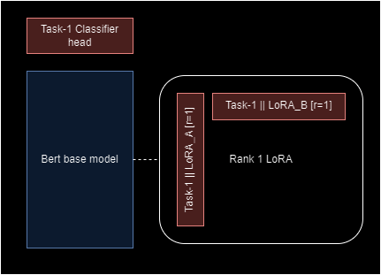
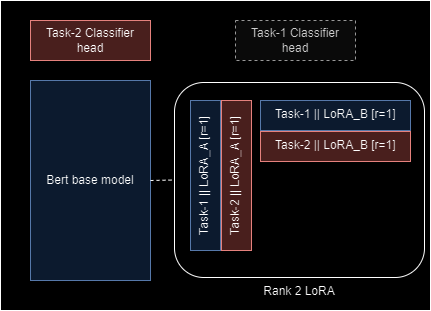

# LoRA-Ensembling

## Trained Bert model with rank-1 LoRA weights

Trained Bert model with rank-1 LoRA weights on `key`, `query`, and `value` weights. Training hyperparameter settings can be found under `hparams/` folder. Training progress can be found on the [wandb report](https://wandb.ai/nikhilchigali/LoRA-Ensembling/reports/Training-LoRA-models--Vmlldzo4NDI2MjM2)

### Tasks
1. [GLUE-SST2](https://huggingface.co/datasets/nyu-mll/glue#sst2-1)
```
sentence: a string feature.
label: a classification label, with possible values including negative (0), positive (1).
idx: a int32 feature.
```

2. [GLUE-CoLA](https://huggingface.co/datasets/nyu-mll/glue#cola-1)
```
sentence: a string feature.
label: a classification label, with possible values including unacceptable (0), acceptable (1).
idx: a int32 feature.
```
3. [GLUE-MNLI](https://huggingface.co/datasets/nyu-mll/glue#mnli-1)
```
premise: a string feature.
hypothesis: a string feature.
label: a classification label, with possible values including entailment (0), neutral (1), contradiction (2).
idx: a int32 feature.
```

### Baseline performance

Bert model trained with Rank-1 LoRAs on the **Tasks 1 & 2**. The performance baselines are as follows,

| Run           | train/loss | val/loss | train/acc | val/acc  |
| ------------- | ---------- | -------- | --------- | -------- |
| SST2 baseline | 0.307144   | 0.331788 | 87.2520   | 84.6330% |
| CoLA baseline | 0.235461   | 0.417150 | 91.8305%  | 81.4423% |

### Stacked LoRAs, No further training

The rank-1 LoRAs from the above baseline bodels are concatenated into a rank-2 adapter. The performance of this new model with no additional training is as follows,

| Run                                        | train/loss | val/loss | train/acc | val/acc  |
| ------------------------------------------ | ---------- | -------- | --------- | -------- |
| Stacked (Rank1: SST2, Rank2: CoLA) on SST2 | 0.475515   | 0.491357 | 78.7643%  | 77.6376% |
| Stacked (Rank1: SST2, Rank2: CoLA) on CoLA | 0.510781   | 0.567528 | 76.1704%  | 73.6538% |
| Stacked (Rank1: CoLA, Rank2: SST2) on CoLA | 0.510725   | 0.567528 | 76.1821%  | 73.6538% |
| Stacked (Rank1: CoLA, Rank2: SST2) on SST2 | 0.475520   | 0.491357 | 78.7672%  | 77.6376% |

Change in metrics as compared to baseline metrics are as follows,
| Run                                        | train/loss | val/loss | train/acc | val/acc   |
| ------------------------------------------ | ---------- | -------- | --------- | --------- |
| Stacked (Rank1: SST2, Rank2: CoLA) on SST2 | 0.168371   | 0.159568 | -8.4878% | -6.9954% |
| Stacked (Rank1: SST2, Rank2: CoLA) on CoLA | 0.275320   | 0.150379 | -15.6601% | -7.7885% |
| Stacked (Rank1: CoLA, Rank2: SST2) on CoLA | 0.275263   | 0.150379 | -15.6484% | -7.7885% |
| Stacked (Rank1: CoLA, Rank2: SST2) on SST2 | 0.168377   | 0.159568 | -8.4848% | -6.9954% |

Refer to *observations.ipynb* for more details


## Stacked LoRAs, with training

The stacked rank-2 LoRAs along with the trained classifier heads from the baseline models are trained together for 1 epoch.

```
wandb: Run summary: [Trained on Task 1 for 1 epoch, with (LoRA1, LoRA2) stacked together as X_0]
wandb:               epoch 0
wandb: trainer/global_step 8415
wandb:          train/loss 0.37353
wandb:            val/loss 0.23744
wandb:           train/acc 87.5%
wandb:             val/acc 90.826%
```
```
wandb: Run summary: [Trained on Task 2 for 1 epoch, with (LoRA1, LoRA2) stacked together as X_0]
wandb:               epoch 0
wandb: trainer/global_step 1067
wandb:          train/loss 0.42605
wandb:            val/loss 0.47149
wandb:           train/acc 75%
wandb:             val/acc 82.019%
```

*TODO: Compare change in performance with `baseline model` and `stacked, no-training` model*
## Work in Progress

- [*To be implemented*] Implement filter/gates for training Mixture of LoRA Experts
- [*To be discussed with prof*] Comparing change in LoRA weights using metrics like Cosine Similarity and subspace similarity. 

  - Measure how far the stacked LoRAs `[LoRA_1, LoRA_2]` have drifted from their baseline `LoRA_1` and `LoRA_2` when trained further and `Task 1` or `Task 2`.
- [*Currently working*] Sequential task learning through rank-1 LoRAs

## Sequential task learning through rank-1 LoRAs

> **Questions:** Training a language model on a downstream `Task 1` using rank-1 LoRA. Can we expand this model further to adapt to another downstream `Task 2`? How much performance are we compromising on `Task 1` by sequentially adapting to a new task?

**Step 1**
- Train the blocks in red (`Task-1` Classifier head and rank 1 LoRA)

- Save the trained classifier and LoRA weights

**Step 2**
- Disable `Task-1` Classifier head and instantiate a new classifier head for `Task-2`
- To the previous LoRA weights, concatenate a new row/column incrementing the rank of the adapter.
  - Rank-1 component corresponds to `Task-1` and the rank-2 component learns `Task-2`
- Train the blocks in red (`Task-2` classifier head, and rank-2 component of the LoRA adapter)



> - When training for `Task-1`, the rank-1 LoRA learns to adapt for the specific task exclusively.
> - When a new task is introduced, a new rank is added to the adapter which has to learn to adapt to this new `Task-2` given `Task-1`'s component in its first rank. 
>   - I want to see how the new rank component would look compared to the first rank. Will it be orthogonal to the rank-1 component? Will the training lead to an adapter with shared subspace for both the tasks?
> - Once trained on `Task-2` while keeping the rank-1 component constant, if we set the `Task-1` classifier head active and re-evaluate, how much of a difference will we see in `Task-1`'s performance? 
>   - One way to switch to running inference for `Task-1` is to use the rank-2 adapter as is and see how it performs
>   - Another way is to mask out all the LoRA components greater than the `Task-1`'s rank to zero. This way we should be able to retain original performance.

*Same process can be extended to additional tasks*